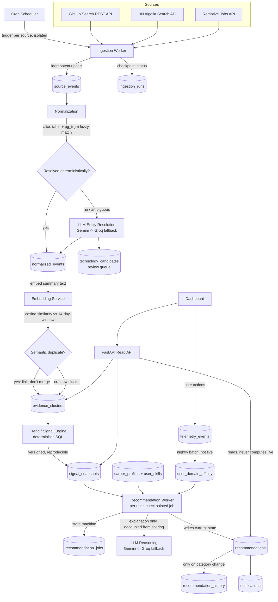

# SIGNAL — Architecture Document

**Focus on what matters. Leave the noise.**

A personalized technology-intelligence system that continuously monitors the software ecosystem and turns evidence into LEARN / WATCH / LATER / IGNORE recommendations, traceable back to the original source that produced them.

---

## 0. Executive Summary

| Decision | Choice | One-line why |
|---|---|---|
| Backend | Python 3.12 + FastAPI | Matches your own stack; async-friendly for I/O-bound ingestion |
| Database | PostgreSQL 16 (+ `pgvector`, `pg_trgm`) | Single source of truth; handles structured state, semantic search, and full-text/fuzzy matching without extra systems |
| Broker (Kafka/RabbitMQ) | **Not used** | No workload needs a distributed log or multiple independent consumer groups — see §V |
| Cache (Redis) | **Not used** | Postgres serves reads fast enough at this volume; caching need is met by conditional HTTP requests + materialized tables — see §P |
| Job orchestration | Postgres-based state machine (`ingestion_runs`, `recommendation_jobs`) | Same proven pattern as OmniListen's `briefing_jobs` — genuinely earned here, not copied blindly |
| Object storage | **Not used** | Signal produces no binary artifacts (no audio, no generated files) |
| Vector layer | `pgvector`, 768-dim | Narrow use: semantic dedup + entity resolution only, never scoring truth |
| LLM | Gemini 2.5 Flash primary, Groq (Llama 3.3 70B) fallback | Narrow tasks only: entity resolution + explanation text. Never touches the numeric score |
| Deployment | Render/Railway (persistent Python service + cron) | FastAPI needs long-running workers, not serverless-only; Vercel-style is JS-oriented |
| Frontend | Existing HTML/CSS prototype now; React/Next.js later | Not the focus of this document — backend depth is |

**The rule this document follows throughout:** every infrastructure choice has to answer *"what breaks if I remove this?"* If the answer is "nothing, at this scale," it's cut.

---

## A. System Architecture

### A.1 End-to-end journey

```
Source (GitHub / HN / Jobs)
   → Ingestion Worker (per-source, checkpointed, idempotent)
   → source_events (raw, immutable)
   → Normalization (parse → normalized_events)
   → Entity Resolution (alias table → fuzzy match → LLM fallback for ambiguous cases)
   → Embedding + Semantic Dedup (evidence_clusters)
   → Trend/Signal Engine (deterministic, windowed, per technology)
   → signal_snapshots (traceable, versioned)
   → Personal Relevance Engine (per user, per technology)
   → Recommendation Worker (checkpointed job, LLM reasoning text)
   → recommendations + recommendation_history
   → Read API (no live computation — just reads the latest computed state)
   → UI
   → telemetry_events (user actions)
   → nightly batch → user_domain_affinity → feeds back into Personal Relevance Engine
```

### A.2 Architecture diagram



### A.3 Component responsibilities

| Component | Responsibility | Does NOT do |
|---|---|---|
| Ingestion Worker | Fetch from one source, persist raw events idempotently, checkpoint run status | Interpret meaning, resolve entities |
| Normalization | Parse raw payload into a canonical shape, attempt deterministic entity match | Call LLM unless deterministic match fails |
| Entity Resolution (LLM path) | Classify ambiguous mentions: known-alias / new-technology / noise | Auto-write to canonical `technologies` table without review |
| Embedding Service | Produce 768-dim vectors for normalized event summaries and technology descriptions | Store anything vector storage claims is "truth" |
| Trend/Signal Engine | Compute deterministic, reproducible per-technology score from evidence | Ask an LLM what the score should be |
| Personal Relevance Engine | Combine signal + user profile + feedback into a relevance number | Recompute the underlying signal score |
| Recommendation Worker | Per-user job: fetch state, score, generate explanation text, publish | Block on LLM failure — falls back to template text |
| Read API | Serve already-computed state fast | Compute anything live in the request path |

---

## B. Technology Choices — Why / Why Not

| Technology | Used? | Why | Why NOT the simpler alternative |
|---|---|---|---|
| **PostgreSQL** | Yes | Relational integrity for evidence chains, ACID for scoring writes, `pg_trgm` for fuzzy alias matching, `pgvector` for semantic search — one system, one operational surface | N/A — this is the simplest option that satisfies everything |
| **pgvector** | Yes, narrowly | Two specific problems need it: (1) detecting that a GitHub release and an HN post describe the same real-world event despite different wording, (2) classifying whether a new mention is a known technology under a new name. Both are similarity problems, not lookup problems | A standalone vector DB (Pinecone/Weaviate) would add an operational system for a workload Postgres handles fine at this scale (low thousands of vectors) |
| **Redis** | **No** | The three things Redis usually buys you — response caching, rate-limit counters, distributed locks — are all satisfiable here: GitHub caching via conditional ETags, rate-limit state in a small Postgres table, and locks via `pg_advisory_lock` (single-process cron, so locks aren't even contested yet) | Adding Redis here would be complexity with no workload behind it — see §P for the full argument and the scale point where this flips |
| **Kafka / RabbitMQ** | **No** | Signal has no requirement for multiple independent consumer groups reading the same event stream differently, and no requirement for stream replay at the volumes it operates at (tens of thousands of events/day, batch cadence, not real-time). A Postgres-based job table does everything actually needed: durable, queryable, checkpointable | Would only be justified if Signal became a real-time multi-consumer system — it isn't one, see §V |
| **Postgres-based job queue** (`ingestion_runs`, `recommendation_jobs`) | Yes | This is the one pattern borrowed directly from OmniListen, because the underlying need is identical: durable per-run state, checkpointing, idempotency keys, so a crashed worker can resume cheaply and LLM spend isn't wasted on retries | A pure in-memory task queue (Celery without persistent backend, or bare asyncio tasks) loses all state on crash — unacceptable given LLM calls are in the critical path |
| **Object storage (S3/Supabase Storage)** | **No** | Signal generates no binary artifacts — no audio, no images, no files. Everything it produces is structured or short text, which belongs in Postgres | N/A — nothing to store |
| **LLM: Gemini primary + Groq fallback** | Yes | Two narrow, bounded tasks (ambiguous entity classification, explanation text) where provider outage shouldn't stall the pipeline. Dual-provider is the same reasoning OmniListen used, applied to a genuinely analogous risk | Single-provider would work at low usage, but a provider outage would silently stop new technologies from being classified and leave recommendations with stale/missing explanations |
| **Kubernetes** | **No** | One deployable FastAPI service + a scheduler is sufficient for a solo-developer, single-tenant portfolio system. Nothing here needs independent scaling of separate services | Would add an entire operational layer to manage a service that isn't decomposed into anything that needs independent scaling |
| **Next.js/React for frontend** | Later, not now | The existing HTML/CSS/vanilla-JS prototype is a fine design reference and can be wired to a real API directly; frontend framework choice doesn't change backend architecture depth, which is what's being evaluated here | — |

---

## C. Source Ingestion Platform

### C.1 Connector abstraction

```python
class SourceConnector(Protocol):
    source_id: str

    async def fetch_since(self, cursor: Cursor) -> list[RawEvent]: ...
    def health_check(self) -> SourceHealth: ...
    def rate_limit_config(self) -> RateLimitConfig: ...
    def auth_config(self) -> AuthConfig: ...
```

Every connector implements this interface and nothing else needs to know its internals. Adding a fourth source later means writing one class, not touching the pipeline.

### C.2 The three initial sources

| Source | What it gives | Cursor / incremental strategy | Rate limit | Auth |
|---|---|---|---|---|
| **GitHub Search/REST API** | Repo activity, stars/forks delta, releases matching tracked technology topics | Per-repo `ETag` for conditional GET (304 = no new data, costs nothing) + `last_checked_at` per tracked topic | 5,000 req/hr authenticated — tracked via response headers, backoff triggers at <10% remaining | Personal access token |
| **HN Algolia Search API** | Discussion volume, points, comment counts for tracked keywords | `last search timestamp` per keyword, date-range query | Generous, unauthenticated, no key required | None |
| **Remotive Jobs API** | Job postings mentioning tracked technologies (remote-only coverage — an honest, stated limitation, not hidden) | `since_id` / page cursor on each poll | Public, free, no key | None |

### C.3 Per-source reliability handling

- **Retry:** transient failures (5xx, timeout, 429) → exponential backoff (30s → 2m → 8m), 3 attempts, then → DLQ.
- **Permanent failure:** 401/403 → no retry, alert immediately (this is a config problem, not a transient one).
- **Malformed data:** individual events that fail schema validation are quarantined into `ingestion_failures` with the raw payload preserved — the *run* doesn't fail because one event is broken.
- **Schema drift:** each connector's parser is a Pydantic model with a version tag; a validation failure that affects >X% of a batch triggers an alert (source likely changed its response shape) rather than silently dropping data.
- **Source health:** `sources.health_status` updated after every run (`healthy` / `degraded` / `down`), surfaced in the UI so a stale technology's low confidence is explainable ("Jobs source hasn't reported in 6 days").
- **No full re-ingestion, ever:** every fetch is cursor-based; a cold restart re-reads from the last successful cursor, not from the beginning.

---

## D. Raw Data & Normalization

```
Raw source payload (JSONB, preserved verbatim)
   ↓ source-specific Parser
Normalized event: { technology_mention_text, event_type, occurred_at, summary_text, source_url }
   ↓ Entity Resolution
{ resolved_technology_id, confidence }
   ↓
normalized_events row
```

**Data contract** (`normalized_events`): every row carries a foreign key straight back to `source_events.id`, and `source_events` carries the full raw payload. This is what makes "click Signal 87 → see the original GitHub release / HN post / job posting" possible — provenance is never discarded, only ever added to.

---

## E. Deduplication

Two different problems, two different mechanisms:

**1. Exact duplicate ingestion** (same GitHub release fetched twice): handled by a database uniqueness constraint — `UNIQUE(source_id, source_native_id)` on `source_events`. A repeated fetch is a no-op upsert. This needs no application logic at all.

**2. Cross-source semantic duplication** (a GitHub release, an HN post about it, and a blog mention are the *same real-world event*, not three independent pieces of evidence): these have different `source_native_id`s, so the constraint above doesn't catch them — and they *shouldn't* be silently deleted, because each is legitimate provenance for the evidence drilldown. Instead:

```
new normalized_event's summary_text
   → embed (768-dim)
   → cosine similarity search against normalized_events from last 14 days for the same technology
   → similarity > 0.92 → link into existing evidence_cluster
   → similarity <= 0.92 → new evidence_cluster
```

The Trend Engine reads from `evidence_clusters`, not raw `normalized_events` — so a story covered by 3 sources counts as **one cluster with a multi-source corroboration bonus** (which *increases confidence*, correctly) rather than three separate pieces of evidence (which would *falsely inflate* momentum). This directly prevents the failure mode of "evidence gets multiplied."

---

## F. Technology Entity Resolution

**Deterministic first, always:**
1. Exact/lowercase match against `technology_aliases`.
2. Fuzzy match via `pg_trgm` trigram similarity for typos/variants ("K8s" → "Kubernetes").

**LLM fallback only for what's left over** — a mention that matches nothing:

```
mention: "OpenSpec"
   → LLM classifies: {is_known_alias: bool, is_new_technology: bool, is_noise: bool,
                       suggested_canonical_name, confidence, reasoning}
   → written to technology_candidates (status: pending)
   → auto-approved ONLY if confidence > 0.9 AND embedding similarity check confirms
     it's not near-duplicate of an existing entry
   → otherwise: sits in a review queue for manual approval
```

This is deliberate: an LLM is never allowed to silently mutate the canonical technology taxonomy. New entities are cheap to create and expensive to clean up once wrong, so the default is a human-reviewed queue, not auto-creation.

**Relationships** (`technology_relationships`) — used for skill-adjacency scoring in §J — are manually curated at seed time for the initial ~25–30 technologies (e.g., `vLLM —part_of→ AI Inference Infrastructure`), and extended over time through the same candidate-review path, not inferred automatically.

---

## G. Vector / Semantic Layer

**Principle, stated once and followed everywhere: Postgres tables are the source of truth. Vectors are a retrieval aid, never authoritative.**

| What's embedded | Why |
|---|---|
| Normalized event summary text | Cross-source semantic dedup (§E) |
| Technology descriptions | New-technology classification against existing canon (§F); "related technologies" surfacing |
| **NOT** raw full evidence bodies | Cost control — only the normalized summary is embedded, not every raw payload |
| **NOT** user profile vectors (phase 1) | Explicitly deferred — "surprising adjacent technology" discovery via profile embedding is a real idea, but not validated as needed yet; adding it later doesn't change the schema |

- **Model:** Gemini `embedding-001`, 768 dimensions.
- **Index:** HNSW (better recall/latency at this small-to-medium scale than IVFFlat, and doesn't need periodic re-training as the corpus grows).
- **Re-embedding:** only on source-text change (rare) or `embedding_model_version` bump — tracked as a column, batch re-embedded on version change, not on every read.

---

## H. Trend / Signal Engine — The Core Intelligence

**Non-negotiable requirement this satisfies: the score must be deterministic and reproducible from stored evidence. No LLM is in this calculation.**

### H.1 Per-source raw feature, per rolling window

For each technology, each source, compute over a 7-day window vs a 28-day trailing baseline:

```
growth_rate = (current_7d_count - baseline_avg_7d) / max(baseline_avg_7d, FLOOR)
   # FLOOR (e.g. 2) prevents divide-by-zero noise for near-new technologies

momentum   = clamp(-1, 3, growth_rate)          # cap outliers from tiny baselines
acceleration = momentum(this_week) - momentum(last_week)

source_score = scale_0_100( 0.6 * momentum + 0.4 * acceleration )
```

### H.2 Combine sources with reliability weights

```
weights = { jobs: 0.40, github: 0.35, hn: 0.25 }   # jobs = strongest real-adoption signal

weighted_signal = Σ(weight_i * source_score_i for sources that reported this window)
                   / Σ(weight_i for sources that reported this window)
   # renormalized over reporting sources only — a missing source doesn't
   # silently drag the score toward zero
```

### H.3 Confidence

```
confidence = (num_sources_reporting / 3) * agreement_factor

agreement_factor = 1.0  if >=2 sources move in the same direction
                  = 0.7  if sources disagree
                  = 0.5  if only 1 source has data
```

### H.4 Hype-risk

```
hype_score = max(0, hn_source_score - avg(job_source_score, github_source_score))
   # discussion volume outrunning real adoption signals
```

### H.5 Final score

```
final_signal = clamp(0, 100, weighted_signal - 0.3 * hype_score)
             * (0.5 + 0.5 * confidence)   # low confidence dampens, never zeroes
```

### H.6 Traceability

Every calculation writes one row to `signal_snapshots`:

```
technology_id, window_start, window_end, formula_version,
raw_features JSONB, component_scores JSONB, momentum, hype_score,
confidence, final_score, computed_at
```

`UNIQUE(technology_id, window_end, formula_version)` — so "Signal 87" is never a mystery. It's `raw_features` + this formula, and if the formula changes, old snapshots stay under their `formula_version` while new ones compute under the new one — historical scores stay honest instead of silently shifting.

---

## I. Hype vs Adoption

Already embedded in §H.4 as `hype_score`, but stated as its own concept because it's a distinct product promise:

- **"People are talking about this"** = high HN `source_score` growth.
- **"People are adopting this"** = high `jobs` + `github` `source_score` growth.
- **Hype risk** = the gap between the two, not either number alone.
- **Sudden viral spikes** are naturally dampened by the `momentum` clamp (§H.1) and the acceleration term, which reward *sustained* growth over a single-week spike.
- **Bot/noise concerns** are handled at the source level (HN Algolia already filters for real submissions; GitHub stars are harder to fake in tracked topic search than raw counts) — this is acknowledged as imperfect, hence confidence scoring rather than a claim of ground truth.

---

## J. Personal Relevance Engine

```
domain_match      = |technology.domain_tags ∩ (user.target_domains ∪ user.interests)|
                     / |technology.domain_tags|                              # 0..1

skill_adjacency    = max over user's current skills s of:
                        1.0  if technology IS a user skill (shown as "mastered", not recommended to learn)
                        0.7  if a direct technology_relationship edge exists to s
                        0.4  if two-hop via the relationship graph
                        0.0  otherwise

learning_effort_penalty = min(1, technology.learning_effort_hours_estimate / experience_budget)
   experience_budget:  junior(1yr)=40h,  mid=60h,  senior=100h   # configurable

affinity_adjustment = user_domain_affinity[technology.primary_domain]   # -0.3..+0.3, from §K

relevance = clamp(0, 100,
              100 * (0.45*domain_match + 0.35*skill_adjacency + 0.20*(1 - learning_effort_penalty))
              + 100 * affinity_adjustment)
```

### Recommendation category boundaries

```
if signal >= 75 and relevance >= 65 and confidence >= 0.6:        LEARN_NOW
elif hype_score > HYPE_THRESHOLD and relevance < 50:               HYPE_RISK
elif signal >= 55 and (relevance >= 45 or confidence < 0.6):       WATCH
elif relevance < 40:                                                LATER
else:                                                                WATCH
```

All thresholds live in a versioned `scoring_config` table — tunable without a code deploy, and every recommendation row records which config version produced it, same traceability principle as §H.6.

---

## K. User Feedback Loop

| Event | Concrete effect |
|---|---|
| `ignored` | Small negative delta to `user_domain_affinity[technology.primary_domain]` — and a smaller negative delta to *related* technologies in the same cluster, so ignoring MCP doesn't leave three MCP-adjacent tools still ranked high |
| `marked_learning` | Positive delta to domain affinity; technology added to a "pending skills" set that immediately participates in `skill_adjacency` for future recommendations |
| `completed_learning` | Technology promoted from "pending" to `user_skills` proper — now scores `skill_adjacency = 1.0` for downstream recommendations |
| `saved` | Small positive delta, weaker than `marked_learning` |
| `viewed` / `opened_evidence` | Logged for observability, does **not** move affinity — casual clicks shouldn't be treated as signal |
| `explicit_rating` (thumbs up/down on a recommendation) | Strongest input, stored in `recommendation_feedback`, feeds directly into the nightly affinity batch with higher weight than implicit actions |

**Important design choice:** affinity is **not** recalculated live on every click. A nightly batch job reads all `telemetry_events` since last run and recomputes `user_domain_affinity` deltas. This avoids oscillation (a user clicking around exploring shouldn't cause recommendations to flicker mid-session) and keeps the update itself explainable as one auditable batch step, not N uncoordinated writes.

---

## L. Asynchronous Processing

Everything off the request path:

| Operation | Why async |
|---|---|
| Source ingestion | External, rate-limited, slow |
| Entity resolution (LLM path) | LLM latency, cost |
| Embedding generation | Batched API calls |
| Trend recalculation | Runs on a schedule over the whole technology set, not per-request |
| Recommendation generation | Per-user, may call LLM for explanation text |
| Notifications | Fire-and-forget after recommendation publish |

**What stays synchronous:** the Read API. It only ever reads already-computed `recommendations` / `signal_snapshots` rows — this is what makes it fast without needing a cache layer (§P).

**Fan-out pattern:** ingestion dispatches one async task per source (source isolation — GitHub failing doesn't block HN or Jobs); recommendation generation dispatches one async task per user (identical reasoning to OmniListen's per-user fan-out, for the identical underlying reason: isolate failure blast radius).

---

## M. Checkpointed Job State — What Actually Needs It

Pipeline: `INIT → FETCH → NORMALIZE → RESOLVE → ANALYZE → RANK → PUBLISH → DONE`

Going stage by stage, honestly:

| Stage | Needs a checkpoint? | Reasoning |
|---|---|---|
| FETCH | **Yes** — `ingestion_runs` | Expensive, rate-limited external call. A crash after fetch-but-before-normalize must not re-fetch and burn rate limit |
| NORMALIZE | No separate checkpoint object | Cheap, deterministic, and naturally resumable — `UNIQUE(source_event_id)` on `normalized_events` means "which raw events are normalized" is just a query, not a state machine |
| RESOLVE (entity resolution) | **Partially** — tracked via `resolved_technology_id IS NULL` on the row itself | LLM calls here cost money; a restart resumes by querying unresolved rows directly — simpler than a separate step table, same crash-safety |
| ANALYZE (trend calc) | No | Pure deterministic SQL aggregation over already-persisted evidence — cheap to redo, just needs to be one atomic transaction per snapshot |
| RANK (per-user recommendation) | **Yes** — `recommendation_jobs`, full state machine | This is the genuinely expensive, per-user, LLM-touching step — same shape as OmniListen's `briefing_jobs` because the underlying need (avoid redoing paid LLM work after a crash) is identical |
| PUBLISH | Covered by idempotency key, no separate checkpoint needed | See §N |

**Example failure — worker dies after ENTITY_RESOLUTION:** since resolution result is written directly onto `normalized_events.resolved_technology_id` (nullable until resolved), a restarted run just does `WHERE resolved_technology_id IS NULL AND source_id = X` and continues. No recovery logic beyond "the query naturally finds unfinished work."

**Example failure — worker dies during RANK, after LLM reasoning-text call succeeds but before PUBLISH:** `recommendation_jobs.current_step` was already advanced to `REASONING_DONE` with the generated text persisted; a restart resumes at `PUBLISH` and does **not** re-call the LLM.

---

## N. Idempotency

| Entity | Idempotency mechanism |
|---|---|
| `source_events` | `UNIQUE(source_id, source_native_id)` |
| `normalized_events` | `UNIQUE(source_event_id)` |
| `signal_snapshots` | `UNIQUE(technology_id, window_end, formula_version)` — recompute with same version+window is a safe upsert |
| `recommendation_jobs` | `UNIQUE(idempotency_key)` where `idempotency_key = rec_<user_id>_<date>` |
| `notifications` | `UNIQUE(user_id, technology_id, recommendation_category, date)` — prevents duplicate alert spam if a job retries |

Duplicate scenarios this actually prevents: a cron trigger firing twice due to a scheduler hiccup; a manual DLQ-recovery re-run overlapping with a scheduled run; a retried recommendation job re-sending the same notification.

---

## O. Retry + DLQ

| Failure type | Examples | Handling |
|---|---|---|
| Transient | Network timeout, 5xx, 429, LLM provider timeout | Retry with exponential backoff (30s → 2m → 8m), 3 attempts |
| Permanent | 401/403 auth failure, invalid source config | No retry — alert immediately, this is a config bug not a blip |
| Unknown / partial | A single malformed event in a batch, an LLM response that fails schema validation | Quarantine the *individual item* (`ingestion_failures`), don't fail the whole run; retry the LLM call once with a stricter prompt, then fall back to template text rather than failing the job |

**DLQ, with a real purpose:**
- **Source-level DLQ** — an `ingestion_run` that exhausted retries lands here. A separate scheduled recovery job retries DLQ items on a longer interval. Critically: *other sources are untouched* — this is the concrete proof of fault isolation, not just a claim.
- **Recommendation-job DLQ** — a per-user job that exhausted retries (e.g., LLM permanently down for that call) lands here; that one user simply doesn't get an updated recommendation until recovery succeeds, while every other user's job proceeds normally.

---

## P. Cache — and Why Redis Isn't Needed

| Candidate for caching | How it's actually handled |
|---|---|
| Source API responses | Conditional HTTP requests (GitHub `ETag`/`If-Modified-Since`) — the cheapest possible cache, no extra system |
| Current recommendations for fast page loads | `recommendations` table **is** the cache — it's a materialized "current state" table, updated on schedule, read directly. Since recompute happens on cron, not on-demand-per-request, there's no stampede risk to prevent in the first place |
| Embeddings | Persisted permanently in `pgvector`, recomputation is the rare exception, not the norm |

**The honest scale trigger for adding Redis later:** if Signal grows to thousands of concurrent users needing sub-millisecond reads, or if recommendation generation moves from scheduled-batch to on-demand-per-request (which would reintroduce stampede risk). Neither is true at this product's actual scale — see §V.

---

## Q. AI Provider Architecture

**Where LLMs are used — and nowhere else:**
1. Ambiguous entity classification (§F) — bounded, structured JSON output.
2. Recommendation explanation text (§J/§K) — grounded in already-computed deterministic evidence, not free generation.

**Design:**
```
call LLM (Gemini, timeout=15s)
   → success + schema-valid → use it
   → timeout/error → retry once (backoff)
   → still failing → fallback provider (Groq)
   → both fail → for entity resolution: leave mention in technology_candidates as unresolved,
                 for reasoning text: publish recommendation with template fallback text,
                 NEVER block the deterministic score from publishing
```

- **Schema validation:** every LLM output is Pydantic-validated; a schema-invalid response is treated as a failure and retried, not silently trusted.
- **Circuit breaker:** lightweight, in-process — N consecutive failures for a provider within a run skips straight to fallback for the rest of that run, instead of hammering a down provider repeatedly.
- **Cost tracking:** every call logged to `llm_usage` (tokens in/out, estimated cost, latency, success) — makes LLM spend visible and answerable in an interview ("how much does this cost to run?").
- **The one rule that matters most here:** deterministic scoring (§H) never depends on an LLM call succeeding. This is what makes the "why not ChatGPT" answer real instead of marketing.

---

## R. Database Schema

### Core tables (full DDL)

```sql
CREATE TABLE technologies (
    id UUID PRIMARY KEY DEFAULT gen_random_uuid(),
    canonical_name TEXT NOT NULL UNIQUE,
    slug TEXT NOT NULL UNIQUE,
    description TEXT,
    description_embedding VECTOR(768),
    domain_tags TEXT[] NOT NULL DEFAULT '{}',
    learning_effort_hours_estimate INT,
    status TEXT NOT NULL DEFAULT 'active' CHECK (status IN ('active','candidate','archived')),
    created_at TIMESTAMPTZ DEFAULT NOW()
);
CREATE INDEX idx_technologies_domain_tags ON technologies USING GIN (domain_tags);

CREATE TABLE technology_aliases (
    id UUID PRIMARY KEY DEFAULT gen_random_uuid(),
    technology_id UUID NOT NULL REFERENCES technologies(id) ON DELETE CASCADE,
    alias_text TEXT NOT NULL,
    UNIQUE (alias_text)
);
CREATE INDEX idx_alias_trgm ON technology_aliases USING GIN (alias_text gin_trgm_ops);

CREATE TABLE technology_relationships (
    id UUID PRIMARY KEY DEFAULT gen_random_uuid(),
    technology_id_a UUID NOT NULL REFERENCES technologies(id),
    technology_id_b UUID NOT NULL REFERENCES technologies(id),
    relationship_type TEXT NOT NULL CHECK (relationship_type IN ('related','successor','part_of')),
    strength FLOAT DEFAULT 1.0,
    UNIQUE (technology_id_a, technology_id_b, relationship_type)
);

CREATE TABLE sources (
    id UUID PRIMARY KEY DEFAULT gen_random_uuid(),
    name TEXT NOT NULL UNIQUE,
    type TEXT NOT NULL CHECK (type IN ('github','hn','jobs')),
    config JSONB NOT NULL DEFAULT '{}',
    is_active BOOLEAN DEFAULT TRUE,
    last_run_at TIMESTAMPTZ,
    health_status TEXT DEFAULT 'unknown'
);

CREATE TABLE source_events (
    id UUID PRIMARY KEY DEFAULT gen_random_uuid(),
    source_id UUID NOT NULL REFERENCES sources(id),
    source_native_id TEXT NOT NULL,
    raw_payload JSONB NOT NULL,
    fetched_at TIMESTAMPTZ DEFAULT NOW(),
    UNIQUE (source_id, source_native_id)
);
CREATE INDEX idx_source_events_fetched ON source_events (fetched_at);

CREATE TABLE normalized_events (
    id UUID PRIMARY KEY DEFAULT gen_random_uuid(),
    source_event_id UUID NOT NULL UNIQUE REFERENCES source_events(id),
    resolved_technology_id UUID REFERENCES technologies(id),
    event_type TEXT NOT NULL,
    summary_text TEXT NOT NULL,
    summary_embedding VECTOR(768),
    evidence_cluster_id UUID,
    occurred_at TIMESTAMPTZ NOT NULL,
    normalized_at TIMESTAMPTZ DEFAULT NOW()
);
CREATE INDEX idx_norm_unresolved ON normalized_events (resolved_technology_id) WHERE resolved_technology_id IS NULL;
CREATE INDEX idx_norm_embedding ON normalized_events USING hnsw (summary_embedding vector_cosine_ops);

CREATE TABLE evidence_clusters (
    id UUID PRIMARY KEY DEFAULT gen_random_uuid(),
    technology_id UUID NOT NULL REFERENCES technologies(id),
    canonical_summary TEXT,
    first_seen_at TIMESTAMPTZ,
    last_seen_at TIMESTAMPTZ,
    source_count INT DEFAULT 1
);

CREATE TABLE ingestion_runs (
    id UUID PRIMARY KEY DEFAULT gen_random_uuid(),
    source_id UUID NOT NULL REFERENCES sources(id),
    status TEXT NOT NULL CHECK (status IN ('PENDING','FETCHING','NORMALIZING','COMPLETED','RETRYING','DEAD_LETTER')),
    current_step TEXT NOT NULL DEFAULT 'INIT',
    started_at TIMESTAMPTZ DEFAULT NOW(),
    completed_at TIMESTAMPTZ,
    error_message TEXT,
    retry_count INT DEFAULT 0
);

CREATE TABLE signal_snapshots (
    id UUID PRIMARY KEY DEFAULT gen_random_uuid(),
    technology_id UUID NOT NULL REFERENCES technologies(id),
    window_start TIMESTAMPTZ NOT NULL,
    window_end TIMESTAMPTZ NOT NULL,
    formula_version TEXT NOT NULL DEFAULT 'v1',
    raw_features JSONB NOT NULL,
    component_scores JSONB NOT NULL,
    momentum FLOAT,
    hype_score FLOAT,
    confidence FLOAT,
    final_score FLOAT NOT NULL,
    computed_at TIMESTAMPTZ DEFAULT NOW(),
    UNIQUE (technology_id, window_end, formula_version)
);

CREATE TABLE recommendation_jobs (
    id UUID PRIMARY KEY DEFAULT gen_random_uuid(),
    user_id UUID NOT NULL REFERENCES users(id),
    run_date DATE NOT NULL,
    status TEXT NOT NULL CHECK (status IN ('PENDING','SCORING','REASONING_DONE','PUBLISHED','FAILED','DEAD_LETTER')),
    current_step TEXT NOT NULL DEFAULT 'INIT',
    idempotency_key TEXT NOT NULL UNIQUE,
    error_message TEXT,
    retry_count INT DEFAULT 0,
    updated_at TIMESTAMPTZ DEFAULT NOW()
);

CREATE TABLE recommendations (
    id UUID PRIMARY KEY DEFAULT gen_random_uuid(),
    user_id UUID NOT NULL REFERENCES users(id),
    technology_id UUID NOT NULL REFERENCES technologies(id),
    category TEXT NOT NULL CHECK (category IN ('LEARN_NOW','WATCH','LATER','HYPE_RISK')),
    signal_score FLOAT NOT NULL,
    relevance_score FLOAT NOT NULL,
    confidence FLOAT NOT NULL,
    reasoning_text TEXT,
    recommendation_date DATE NOT NULL,
    UNIQUE (user_id, technology_id, recommendation_date)
);

CREATE TABLE recommendation_history (
    id UUID PRIMARY KEY DEFAULT gen_random_uuid(),
    user_id UUID NOT NULL REFERENCES users(id),
    technology_id UUID NOT NULL REFERENCES technologies(id),
    previous_category TEXT,
    new_category TEXT NOT NULL,
    changed_at TIMESTAMPTZ DEFAULT NOW()
    -- append-only: one row per category CHANGE, not one row per day
);
```

### Remaining tables (summary)

| Table | Purpose | Key constraint |
|---|---|---|
| `users` | Auth identity | `email` unique |
| `career_profiles` | Goal, experience, target domains | `user_id` unique (1:1) |
| `user_skills` | Current skills, includes "pending" from `marked_learning` | `(user_id, technology_id)` unique |
| `technology_candidates` | LLM-suggested new entities awaiting review | status enum |
| `ingestion_failures` | Quarantined malformed individual events | — |
| `telemetry_events` | Raw user interaction log | indexed on `(user_id, created_at)` |
| `user_domain_affinity` | Nightly-batch-computed preference deltas | `(user_id, domain_tag)` unique |
| `notifications` | "What changed" alerts | dedup constraint per §N |
| `llm_usage` | Cost/latency tracking per call | — |
| `scoring_config` | Versioned thresholds/weights for §H and §J | version column |

**Transaction boundaries:** each `signal_snapshots` write is one transaction (atomic — no partial score rows). Each `recommendation_jobs` step transition is its own transaction, so a crash mid-job leaves a consistent `current_step`, never a half-written recommendation.

---

## S. History & Reprocessing

Signal's core promise ("what changed") depends entirely on retained history:

- **Raw retention:** `source_events` kept indefinitely (small volume, cheap, and it's the ultimate provenance record).
- **Normalized retention:** kept indefinitely, partitioned by month once volume justifies it (§V).
- **Aggregate history:** every `signal_snapshots` row is permanent, never overwritten — "what was AI Inference Infrastructure's score 30 days ago" is a direct query, not a reconstruction.
- **Recommendation history:** `recommendation_history` is append-only and only writes on an actual category change — this is the literal backing data for the "what changed since you last visited" UI, which is the retention hook identified in the product review.
- **Recomputation when scoring logic changes:** `formula_version` (§H.6) and `scoring_config` version (§J) mean a formula improvement can be backfilled over historical windows *without deleting or corrupting* what the old formula said — both live side by side, tagged.

---

## T. Observability

| Category | What's tracked |
|---|---|
| Source health | freshness (time since last successful run), throughput, failure rate, per-source health_status |
| Pipeline | queue depth (`ingestion_runs`/`recommendation_jobs` in PENDING), worker latency per stage, retry counts, DLQ size |
| Entity resolution | % resolved deterministically vs LLM-fallback rate (this ratio should improve over time as aliases grow — a genuinely interesting metric to show) |
| AI provider | latency, cost (`llm_usage`), fallback-trigger rate, schema-validation failure rate |
| Scoring | trend calculation duration, snapshot count per run |
| Recommendation | category-change rate per run (spikes here are worth investigating — did the formula change, or did the ecosystem actually move?) |
| Data quality | source disagreement rate (§H.3 `agreement_factor` distribution), cache-equivalent hit behavior (how often `recommendations` is fresh vs stale on read) |

Logged: every job state transition. Metered: counts/latencies above. Traced: a single `recommendation_job` from `INIT` to `PUBLISHED`, correlated by `idempotency_key`, so one failed job is fully replayable in logs end to end.

---

## U. Security

- **Auth:** standard email/password or OAuth for `users`; session/JWT for API access.
- **Secrets:** source API tokens and LLM keys in environment-managed secrets (Render/Railway secret store), never in `sources.config` JSONB in plaintext.
- **Source credentials:** scoped, read-only tokens only.
- **Tenant isolation:** single-tenant per user_id row-level scoping on every user-facing query — no cross-user data leakage path exists because there's no shared mutable state per user beyond their own rows.
- **Rate limiting:** on the public API, standard per-IP/per-user limits; internally, source rate limits are respected proactively (§C), not just reactively.
- **Untrusted content:** raw source text (HN comments, job descriptions) is never interpolated directly into an LLM prompt without being clearly delimited as data, not instruction — basic prompt-injection hygiene, since these sources are public and unmoderated.
- **API abuse:** standard FastAPI rate-limiting middleware; nothing exotic needed at this scale.

---

## V. Scale Analysis — Bottlenecks, Not Buzzwords

| Scale | Actual bottleneck | Minimal real fix |
|---|---|---|
| **10 sources / 10K events/day** (current target) | None meaningful. LLM cost from ambiguous entity resolution is the only real variable cost | Current design as-is |
| **100 sources / 100K events/day** | Sequential per-source ingestion won't finish inside a cron window. Burst writes need batching | Fan out ingestion as concurrent async tasks (already designed for, §L) rather than a sequential loop; switch to batch `INSERT`/`COPY` instead of row-by-row. Postgres write volume itself (~1.2 writes/sec average) is still trivial |
| **1,000 sources / 1M events/day** | Three real bottlenecks: (1) dispatching 1,000 concurrent HTTP fetches from one process needs actual concurrency control, not just `asyncio.gather` — a proper worker pool with backpressure; (2) embedding-generation API cost/latency becomes material; (3) full-window SQL aggregation over raw events gets slow — needs daily rollup tables so trend windows aggregate from rollups, not raw rows | Worker pool with bounded concurrency (still not Kafka — this is directed task dispatch with a known consumer, not a pub/sub stream needing multiple independent readers); batch embedding calls; monthly-partition `source_events`/`normalized_events`; pre-aggregate daily rollups |

**Why Kafka never becomes the right answer here, even at 1M events/day:** Signal has one producer pattern (scheduled ingestion) and one consumer pattern (the pipeline) — there's no second, independent system that needs to read the same event stream differently. Kafka earns its complexity when you need replay for multiple divergent consumers; Signal doesn't have multiple consumers, it has one pipeline getting more concurrent workers.

---

## W. Local Development

```yaml
# docker-compose.yml
services:
  postgres:
    image: pgvector/pgvector:pg16
    environment:
      POSTGRES_DB: signal
    ports: ["5432:5432"]
    volumes: ["pgdata:/var/lib/postgresql/data"]

  api:
    build: ./backend
    command: uvicorn app.main:app --reload --host 0.0.0.0
    depends_on: [postgres]
    env_file: .env
    ports: ["8000:8000"]

  worker:
    build: ./backend
    command: python -m app.workers.scheduler_loop
    depends_on: [postgres]
    env_file: .env

  frontend:
    build: ./frontend
    ports: ["5173:5173"]
    depends_on: [api]

volumes:
  pgdata:
```

- **Seed data:** a `seed.py` script inserts the ~25–30 curated technologies + aliases + relationships (matching the existing UI mockup's technology list) so the app is immediately demoable without waiting on live ingestion.
- **Observability locally:** structured JSON logging to stdout is sufficient — no need to stand up a metrics stack locally.
- Full pipeline reproducible with `docker compose up` + `python -m app.workers.run_once --source=hn` to trigger one ingestion manually.

---

## X. Cloud Deployment

| Environment | Setup |
|---|---|
| **Development** | Local Docker Compose (§W) |
| **Staging** | Render/Railway free-tier Postgres + one API instance, scheduled jobs run at reduced frequency |
| **Production** | Render/Railway persistent web service (FastAPI) + Render Cron Jobs (or Railway's scheduled jobs) triggering the ingestion/recommendation endpoints on schedule; managed Postgres with `pgvector` enabled (Supabase or Render Postgres, both support the extension) |

- **Why not Vercel:** Vercel's serverless model fits Next.js/JS well (as OmniListen used it) but fights against a Python FastAPI service that needs longer-running background workers — a persistent-service host is the better fit here, not a downgrade in ambition.
- **Secrets:** platform-native secret manager (Render/Railway env vars), never committed.
- **Logs/metrics:** platform-native log aggregation to start; a lightweight `/metrics` endpoint (Prometheus format) can be added without new infrastructure if needed later.

---

## Y. Testing — Tests That Prove the Architecture

| Test | Proves |
|---|---|
| `test_idempotent_ingestion` | Same source fetched twice → row count unchanged, zero duplicate LLM calls (assert mock call count) |
| `test_worker_crash_resume` | Kill process mid-run after entity resolution → restart resumes only unresolved rows, no re-fetch |
| `test_retry_backoff_dlq` | Mock connector failing 3x → DLQ row created with correct `retry_count`; **other sources' `ingestion_runs` unaffected** |
| `test_llm_failure_isolation` | Mock LLM timeout → `signal_snapshots` still computed correctly (deterministic path unaffected); `reasoning_text` falls back to template |
| `test_semantic_dedup` | Two differently-worded evidence texts about the same event → one `evidence_cluster`, trend engine counts it once with a corroboration bonus, not double-counted |
| `test_entity_resolution_conflict` | Two near-simultaneous ambiguous mentions of a new technology → no duplicate `technology_candidates` row |
| `test_concurrent_recommendation_jobs` | Two overlapping job triggers for the same user/date → unique constraint on `idempotency_key` prevents duplicate recommendation rows |
| `test_stale_recommendation` | Recommendation older than N days without a fresh snapshot → flagged `stale: true` in API response |
| `test_transaction_atomicity` | Simulated failure mid-`signal_snapshots` write → no partial row committed |
| `test_ingestion_burst_load` | 1,000 `source_events` inserted in a burst → measure `ingestion_run` completion time, assert no blocking of concurrent unrelated runs |

---

## Z. Killer Demo

The single best live demonstration, designed specifically for Signal's actual failure modes:

1. Force the GitHub connector to return HTTP 500.
2. UI shows `ingestion_runs` for GitHub transition `PENDING → RETRYING (x3, visible backoff timestamps) → DEAD_LETTER`.
3. **Meanwhile**, HN and Jobs sources complete normally — the technology's `signal_snapshots` still computes, but `confidence` is visibly lower and the evidence drilldown shows *"2 of 3 sources reporting."*
4. Trigger the DLQ recovery endpoint manually.
5. GitHub run replays **from its checkpoint** — conditional `ETag` means it does not re-fetch anything already ingested.
6. Confidence recalculates upward as the third source comes back online.
7. A user's recommendation for that technology flips from `WATCH → LEARN_NOW` live, and `recommendation_history` shows the exact timestamp and the category transition that caused it.

This single sequence proves: source isolation, checkpointed resume, DLQ recovery, confidence-aware (not binary) scoring, and a real, traceable recommendation change — end to end, without touching anything fabricated.

---

## AA. Final Architecture Summary

1. **Stack:** FastAPI + PostgreSQL (`pgvector`, `pg_trgm`) + a Postgres-based job state machine. No broker, no cache layer, no container orchestration.
2. **Data flow:** Source → idempotent raw storage → deterministic-first entity resolution (LLM only for the ambiguous remainder) → semantic dedup via embeddings → deterministic trend scoring → personal relevance → checkpointed per-user recommendation job → traceable, versioned output.
3. **Job model:** two state machines earn their existence — `ingestion_runs` (protects against re-spending on rate-limited fetches) and `recommendation_jobs` (protects against re-spending on LLM calls) — modeled directly on OmniListen's proven `briefing_jobs` pattern because the underlying risk is genuinely the same.
4. **Scoring:** fully deterministic, versioned, reproducible from stored raw features — the one requirement the whole product's credibility rests on.
5. **Reliability:** per-source and per-user fault isolation, retry+backoff+DLQ everywhere a transient external dependency exists, idempotency keys everywhere a duplicate write is possible.
6. **Deployment:** solo-developer-appropriate — one persistent service, scheduled jobs, managed Postgres, no orchestration layer.

---

## AB. Build Plan

| Phase | Build | DB changes | Tests | Demonstrates | Validates |
|---|---|---|---|---|---|
| **1. Smallest real product** | Manual profile input, ONE source (HN — easiest, no auth), manual ingestion script, seeded ~25 technologies, v0 signal score (single-source), domain-tag-only relevance, static thresholds, wire existing HTML dashboard to real data | `technologies`, `technology_aliases`, `source_events`, `normalized_events`, `signal_snapshots` (v0) | Score computes correctly from real evidence | A real, explainable score from real data, in the existing UI | **The biggest existential risk: can real evidence produce a plausible score at all?** |
| **2. Real ingestion** | Add GitHub + Jobs connectors, cron-triggered, `SourceConnector` abstraction | `sources`, `ingestion_runs` | Idempotent double-fetch test | Multi-source ingestion running on schedule | Connector abstraction actually generalizes |
| **3. Normalization + entity resolution** | Alias table, `pg_trgm` fuzzy match, LLM fallback, candidate review queue | `technology_relationships`, `technology_candidates` | Entity resolution conflict test | New technologies get classified correctly | Deterministic-first resolution keeps LLM usage low |
| **4. Trend/signal engine v1** | Full multi-source weighted formula, confidence, hype-risk | `signal_snapshots` (formula_version) | Reproducibility test (same inputs → same score) | Full §H formula live, clickable evidence | Score is genuinely explainable, not black-box |
| **5. Personal relevance** | Skill adjacency graph, learning effort, career-goal weighting, category boundaries | `career_profiles`, `user_skills`, `scoring_config` | Boundary condition tests | Personalized LEARN/WATCH/LATER output | Relevance meaningfully differs between two different user profiles |
| **6. Async processing** | Fan-out ingestion workers, fan-out per-user recommendation workers | — | Concurrency test | Multiple sources/users processed in parallel | No serialization bottleneck at target scale |
| **7. Checkpointing + idempotency + retry/DLQ** | `recommendation_jobs` state machine, DLQ recovery endpoint | `recommendation_jobs`, `ingestion_failures` | Crash-resume test, DLQ test | The Killer Demo (§Z) works end to end | Reliability claims are real, not aspirational |
| **8. AI enrichment** | LLM reasoning text with fallback provider, decoupled from scoring, cost tracking | `llm_usage` | LLM-failure-isolation test | Explanation text with provider fallback | LLM outage never corrupts the score |
| **9. Feedback loop** | Telemetry capture, nightly affinity batch, `recommendation_history` "what changed" view | `telemetry_events`, `user_domain_affinity`, `recommendation_history` | Affinity recompute test | Recommendations visibly shift after user action | Personalization is real, not decorative |
| **10. Production deployment** | Render/Railway deploy, cron config, secrets, basic observability dashboard | — | Load test | Live public URL, running on schedule | System survives outside a laptop |

---

## AC. What NOT to Build

- **No Kafka/RabbitMQ** — no workload needs a distributed log at this scale (§V).
- **No Redis** — Postgres + conditional HTTP requests cover the actual caching need (§P).
- **No Kubernetes** — one deployable service is sufficient for solo-dev scale.
- **No microservices split** — one FastAPI service with internal modules (`ingestion/`, `resolution/`, `scoring/`, `recommendation/`); split only if a concrete independent-scaling need appears.
- **No autonomous multi-step AI agents** — every LLM call here is a narrow, schema-validated, single-purpose function call, not a free-form agent loop.
- **No auto-approving LLM-suggested technologies** into the canonical taxonomy without review.
- **No user-profile embedding matching in phase 1** — a real idea, not yet a validated need.
- **No building for 1,000-source scale on day one** — that's premature optimization for a product that will run with 3 sources; let real bottlenecks justify each next step.
- **No object storage** — nothing binary to store.
- **No event sourcing / CQRS** — current-state tables plus one explicit append-only history table (`recommendation_history`) give full traceability without the overhead of full event sourcing.

---

## AD. Resume-Level Engineering

**Capabilities this architecture genuinely demonstrates, if fully implemented:**
- Data engineering (multi-source ingestion, normalization, deduplication)
- Distributed-systems reliability patterns (checkpointing, idempotency, retry/backoff, DLQ, fault isolation)
- AI systems engineering (dual-provider fallback, decoupling deterministic logic from LLM calls, schema-validated outputs, cost tracking)
- Applied personalization (feedback-driven scoring, not static rules)
- Database design (traceable, versioned, historically-queryable schema)
- Asynchronous processing (fan-out with bounded concurrency)
- Production deployment on a real, non-toy infrastructure

**Resume bullets — every claim backed by something actually built above, nothing inflated:**

- Built a personalized technology-intelligence platform that ingests evidence from 3 external APIs, computes a deterministic and reproducible relevance score per technology with full evidence traceability, and generates personalized learn/watch/ignore recommendations per user.
- Designed a fault-tolerant ingestion pipeline with per-source isolation, exponential-backoff retries, and dead-letter-queue recovery, verified with tests that simulate source failure without affecting unaffected sources.
- Implemented a checkpointed, idempotent per-user recommendation job pipeline to prevent duplicate LLM spend and guarantee safe resumption after a worker crash.
- Built a semantic-deduplication layer using `pgvector` cosine similarity to prevent cross-source evidence from artificially inflating a technology's adoption signal, replacing naive counting with corroboration-based confidence.
- Decoupled deterministic scoring from LLM-based explanation generation so that AI-provider outages degrade explanation quality without corrupting the core recommendation logic, validated with provider-failure-injection tests.

---

### The one test every component in this document has to pass

*If I remove it, which specific Signal requirement breaks?* Every section above answers that question directly. Anything that couldn't survive that question was already cut before this document was written — that's why there's no Kafka, no Redis, and no Kubernetes in it.
